# 反混淆

* 反混淆概述
  * 混淆
    * 很多app都做了代码混淆处理，导致解析出来的（类、属性、函数等）变量名，都是混淆后的值
      * 典型的是`a`、`b`、`c`、`d`等值
      * 让（逆向的）你看难直接看出代码逻辑
  * 反混淆
    * 部分反编译器，比如此处的jadx，支持（基本的）反混淆
      * 所谓的基本的反混淆，主要指的是：变量的重名名
        * 比如，至少可以把`a`变成`C12657a`，`w`变成`p647w`等，至少看起来能稍微容易区分出不同变量值，让（逆向的）你，看反混淆后的代码的逻辑，稍微降低点难度

## Jadx中如何开启反混淆`deobfuscation`

* jadx中开启反混淆
  * cli=命令行：加参数`--deobf`
    * 举例
      ```bash
      jadx --deobf -d . 360Wallpaper_1.0.4_apkcombo.com.apk
      ```
    * 更多相关子参数，可以根据需求去设置
      ```bash
        --deobf                             - activate deobfuscation
        --deobf-min                         - min length of name, renamed if shorter, default: 3
        --deobf-max                         - max length of name, renamed if longer, default: 64
        --deobf-cfg-file                    - deobfuscation map file, default: same dir and name as input file with '.jobf' extension
        --deobf-cfg-file-mode               - set mode for handle deobfuscation map file:
                                              'read' - read if found, don't save (default)
                                              'read-or-save' - read if found, save otherwise (don't overwrite)
                                              'overwrite' - don't read, always save
                                              'ignore' - don't read and don't save
        --deobf-use-sourcename              - use source file name as class name alias
        --deobf-parse-kotlin-metadata       - parse kotlin metadata to class and package names
        --deobf-res-name-source             - better name source for resources:
                                              'auto' - automatically select best name (default)
                                              'resources' - use resources names
                                              'code' - use R class fields names
      ```
      * 详见：[jadx的help语法](../jadx_help/README.md)
  * gui=图形界面：勾选`Enable deobfuscation`
    * 默认没有勾选`Enable deobfuscation`，各子参数也是灰色不可设置
      * 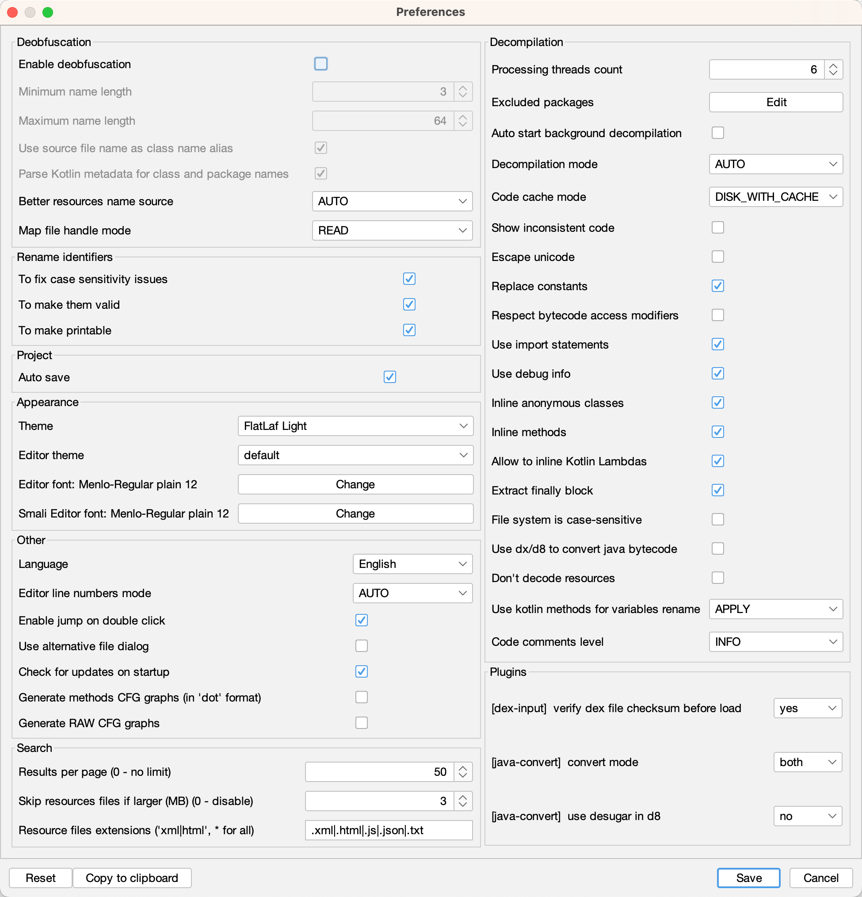
    * 勾选上`Enable deobfuscation`
      * 注：相关子项参数，则可以（根据自己需要去）设置了
      * 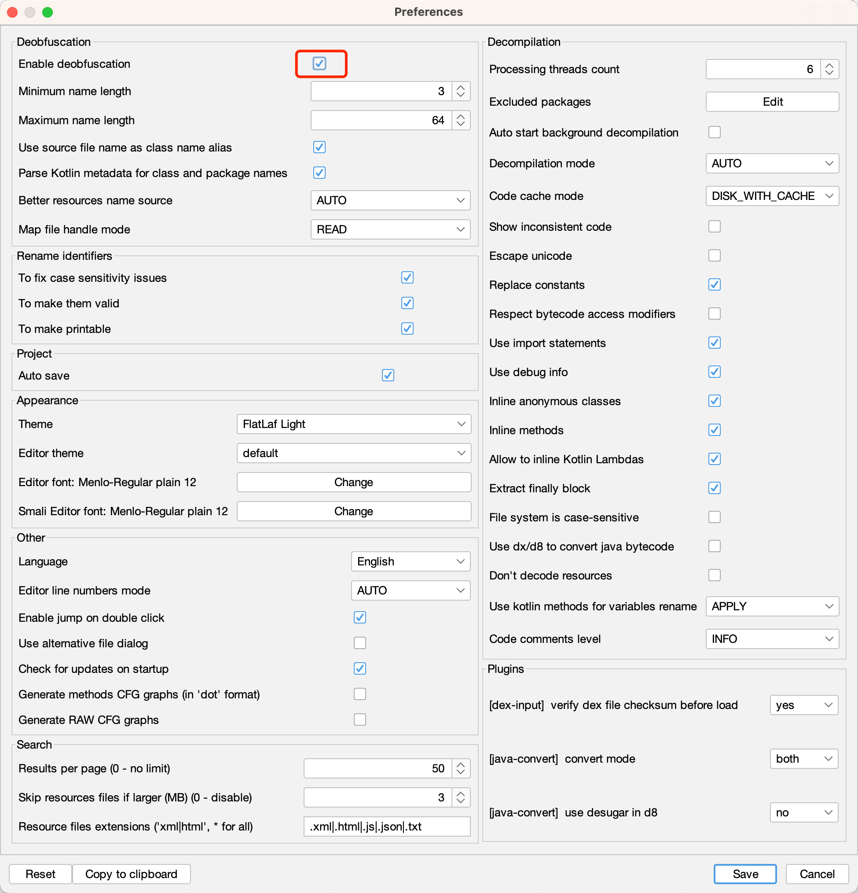

## 反混淆前后效果对比

### cli命令行版本输出代码结果详细对比

* `AndroidMenifest.xml`反混淆前后对比
  * 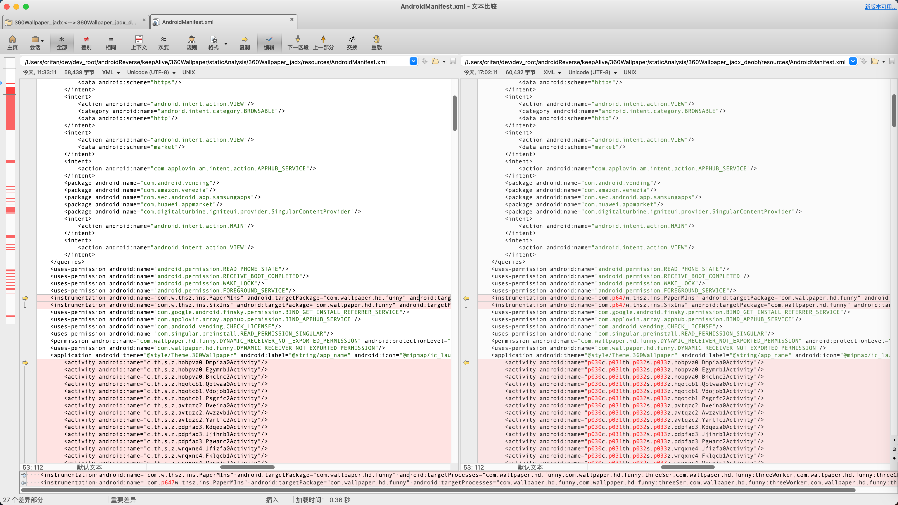
  * 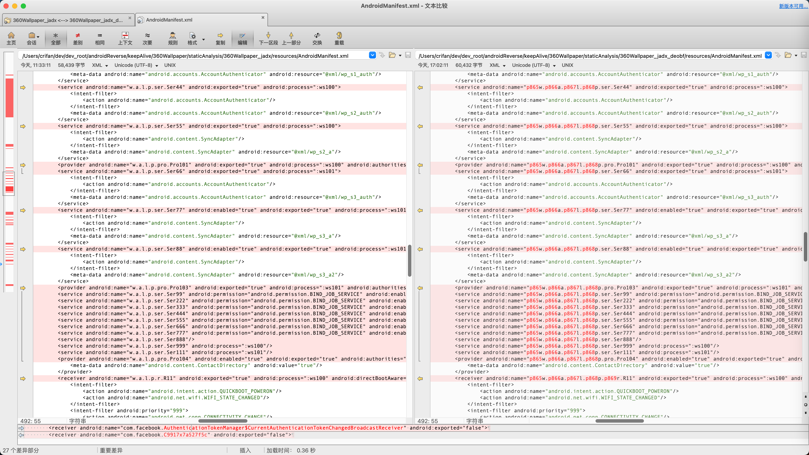
* 类名目录对比
  * 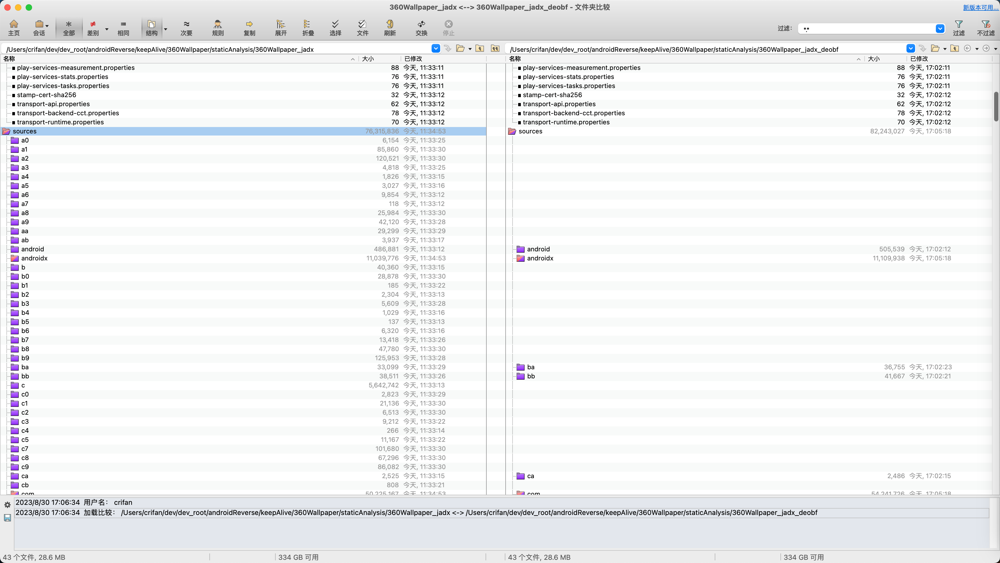
  * 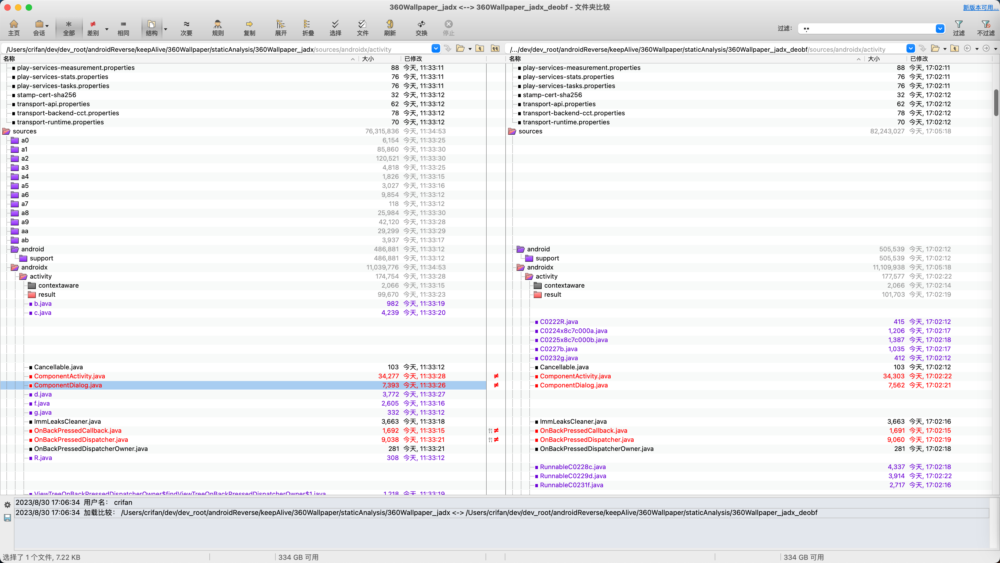
* 某个类：ComponetDialog
  * 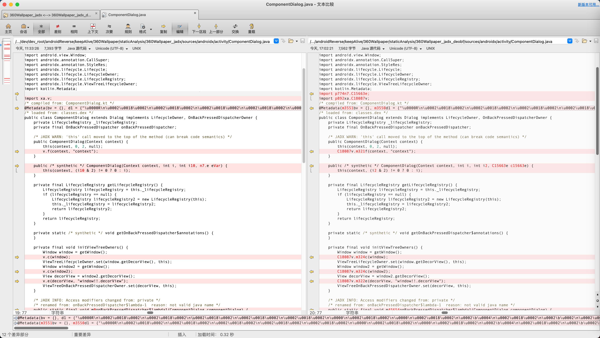

#### 某个类的代码详细对比

总体效果的截图对比：

* 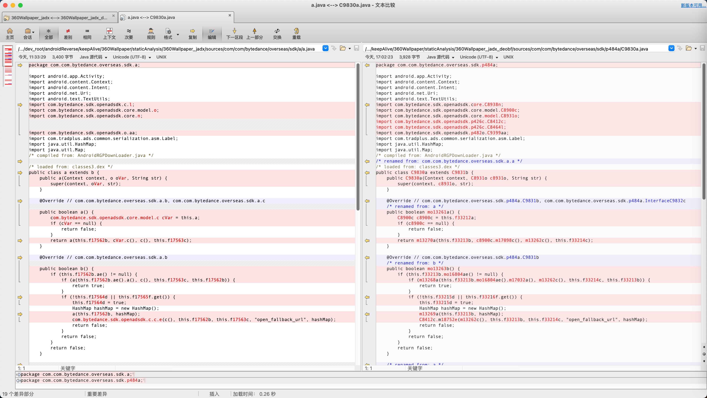

详细代码：

* 混淆前：`360Wallpaper_jadx/sources/com/com/bytedance/overseas/sdk/a/a.java`

```java
package com.com.bytedance.overseas.sdk.a;


import android.app.Activity;
import android.content.Context;
import android.content.Intent;
import android.net.Uri;
import android.text.TextUtils;
import com.bytedance.sdk.openadsdk.c.l;
import com.bytedance.sdk.openadsdk.core.model.o;
import com.bytedance.sdk.openadsdk.core.n;
import com.bytedance.sdk.openadsdk.o.aa;
import com.tradplus.ads.common.serialization.asm.Label;
import java.util.HashMap;
import java.util.Map;
/* compiled from: AndroidRGPDownLoader.java */
/* loaded from: classes3.dex */
public class a extends b {
    public a(Context context, o oVar, String str) {
        super(context, oVar, str);
    }


    @Override // com.com.bytedance.overseas.sdk.a.b, com.com.bytedance.overseas.sdk.a.c
    public boolean a() {
        com.bytedance.sdk.openadsdk.core.model.c cVar = this.a;
        if (cVar == null) {
            return false;
        }
        return a(this.f17562b, cVar.c(), c(), this.f17563c);
    }


    @Override // com.com.bytedance.overseas.sdk.a.b
    public boolean b() {
        if (this.f17562b.ae() != null) {
            if (a(this.f17562b.ae().a(), c(), this.f17563c, this.f17562b)) {
                return true;
            }
            if (!this.f17564d || this.f17565f.get()) {
                this.f17564d = true;
                HashMap hashMap = new HashMap();
                a(this.f17562b, hashMap);
                com.bytedance.sdk.openadsdk.c.c.e(c(), this.f17562b, this.f17563c, "open_fallback_url", hashMap);
                return false;
            }
            return false;
        }
        return false;
    }


    public static boolean a(o oVar, String str, Context context, String str2) {
        Intent a;
        if (oVar != null && oVar.av() == 0) {
            return false;
        }
        try {
            if (TextUtils.isEmpty(str) || (a = aa.a(context, str)) == null) {
                return false;
            }
            a.putExtra("START_ONLY_FOR_ANDROID", true);
            if (!(context instanceof Activity)) {
                a.addFlags(Label.FORWARD_REFERENCE_TYPE_SHORT);
            }
            context.startActivity(a);
            HashMap hashMap = new HashMap();
            a(oVar, hashMap);
            com.bytedance.sdk.openadsdk.c.c.e(context, oVar, str2, "click_open", hashMap);
            return true;
        } catch (Throwable unused) {
        }
        return false;
    }


    public static boolean a(String str, Context context, String str2, o oVar) {
        try {
            if (TextUtils.isEmpty(str)) {
                return false;
            }
            Uri parse = Uri.parse(str);
            Intent intent = new Intent("android.intent.action.VIEW");
            intent.setData(parse);
            if (!(context instanceof Activity)) {
                intent.addFlags(Label.FORWARD_REFERENCE_TYPE_SHORT);
            }
            HashMap hashMap = new HashMap();
            a(oVar, hashMap);
            com.bytedance.sdk.openadsdk.c.c.e(n.a(), oVar, str2, "open_url_app", hashMap);
            context.startActivity(intent);
            l.a().a(oVar, str2);
            return true;
        } catch (Throwable unused) {
            return false;
        }
    }


    private static void a(o oVar, Map<String, Object> map) {
        if (oVar != null) {
            map.put("auto_click", Boolean.valueOf(!oVar.a()));
        }
    }
}
```

* 混淆后：（类相应的也改名了）`360Wallpaper_jadx_deobf/sources/com/com/bytedance/overseas/sdk/p484a/C9830a.java`

```java
package com.com.bytedance.overseas.sdk.p484a;


import android.app.Activity;
import android.content.Context;
import android.content.Intent;
import android.net.Uri;
import android.text.TextUtils;
import com.bytedance.sdk.openadsdk.core.C8938n;
import com.bytedance.sdk.openadsdk.core.model.C8900c;
import com.bytedance.sdk.openadsdk.core.model.C8931o;
import com.bytedance.sdk.openadsdk.p426c.C8412c;
import com.bytedance.sdk.openadsdk.p426c.C8464l;
import com.bytedance.sdk.openadsdk.p482o.C9399aa;
import com.tradplus.ads.common.serialization.asm.Label;
import java.util.HashMap;
import java.util.Map;
/* compiled from: AndroidRGPDownLoader.java */
/* renamed from: com.com.bytedance.overseas.sdk.a.a */
/* loaded from: classes3.dex */
public class C9830a extends C9831b {
    public C9830a(Context context, C8931o c8931o, String str) {
        super(context, c8931o, str);
    }


    @Override // com.com.bytedance.overseas.sdk.p484a.C9831b, com.com.bytedance.overseas.sdk.p484a.InterfaceC9832c
    /* renamed from: a */
    public boolean mo13261a() {
        C8900c c8900c = this.f33212a;
        if (c8900c == null) {
            return false;
        }
        return m13270a(this.f33213b, c8900c.m17098c(), m13262c(), this.f33214c);
    }


    @Override // com.com.bytedance.overseas.sdk.p484a.C9831b
    /* renamed from: b */
    public boolean mo13263b() {
        if (this.f33213b.mo16804ae() != null) {
            if (m13268a(this.f33213b.mo16804ae().m17032a(), m13262c(), this.f33214c, this.f33213b)) {
                return true;
            }
            if (!this.f33215d || this.f33216f.get()) {
                this.f33215d = true;
                HashMap hashMap = new HashMap();
                m13269a(this.f33213b, hashMap);
                C8412c.m18752e(m13262c(), this.f33213b, this.f33214c, "open_fallback_url", hashMap);
                return false;
            }
            return false;
        }
        return false;
    }


    /* renamed from: a */
    public static boolean m13270a(C8931o c8931o, String str, Context context, String str2) {
        Intent m14850a;
        if (c8931o != null && c8931o.mo16787av() == 0) {
            return false;
        }
        try {
            if (TextUtils.isEmpty(str) || (m14850a = C9399aa.m14850a(context, str)) == null) {
                return false;
            }
            m14850a.putExtra("START_ONLY_FOR_ANDROID", true);
            if (!(context instanceof Activity)) {
                m14850a.addFlags(Label.FORWARD_REFERENCE_TYPE_SHORT);
            }
            context.startActivity(m14850a);
            HashMap hashMap = new HashMap();
            m13269a(c8931o, hashMap);
            C8412c.m18752e(context, c8931o, str2, "click_open", hashMap);
            return true;
        } catch (Throwable unused) {
        }
        return false;
    }


    /* renamed from: a */
    public static boolean m13268a(String str, Context context, String str2, C8931o c8931o) {
        try {
            if (TextUtils.isEmpty(str)) {
                return false;
            }
            Uri parse = Uri.parse(str);
            Intent intent = new Intent("android.intent.action.VIEW");
            intent.setData(parse);
            if (!(context instanceof Activity)) {
                intent.addFlags(Label.FORWARD_REFERENCE_TYPE_SHORT);
            }
            HashMap hashMap = new HashMap();
            m13269a(c8931o, hashMap);
            C8412c.m18752e(C8938n.m16660a(), c8931o, str2, "open_url_app", hashMap);
            context.startActivity(intent);
            C8464l.m18615a().m18612a(c8931o, str2);
            return true;
        } catch (Throwable unused) {
            return false;
        }
    }


    /* renamed from: a */
    private static void m13269a(C8931o c8931o, Map<String, Object> map) {
        if (c8931o != null) {
            map.put("auto_click", Boolean.valueOf(!c8931o.m16924a()));
        }
    }
}
```


### GUI版本中的对比

#### 未开启反混淆

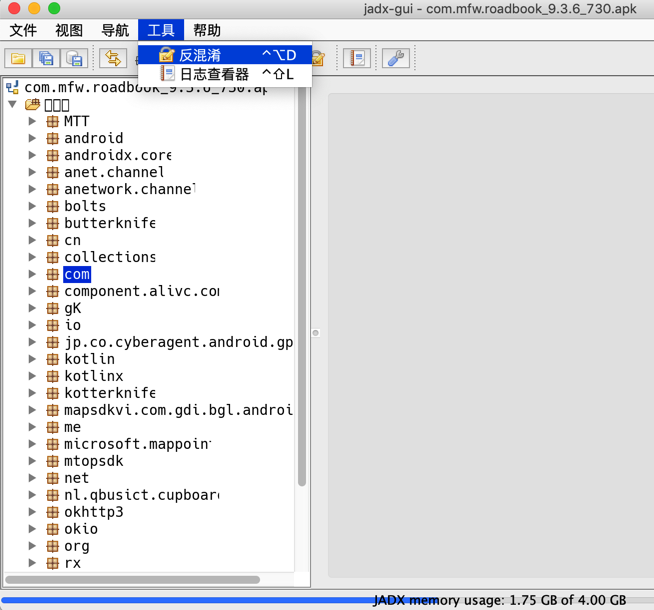

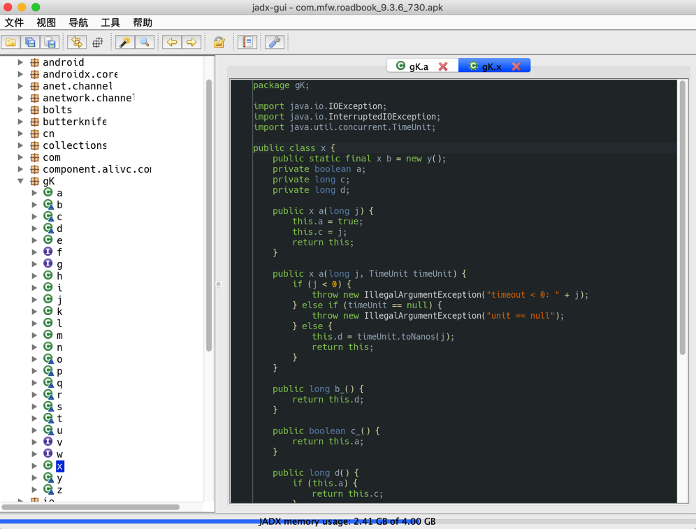

-》都是a,b,c,d,j等变量名

#### 开启反混淆


之前的gK,io等，就反混淆了：

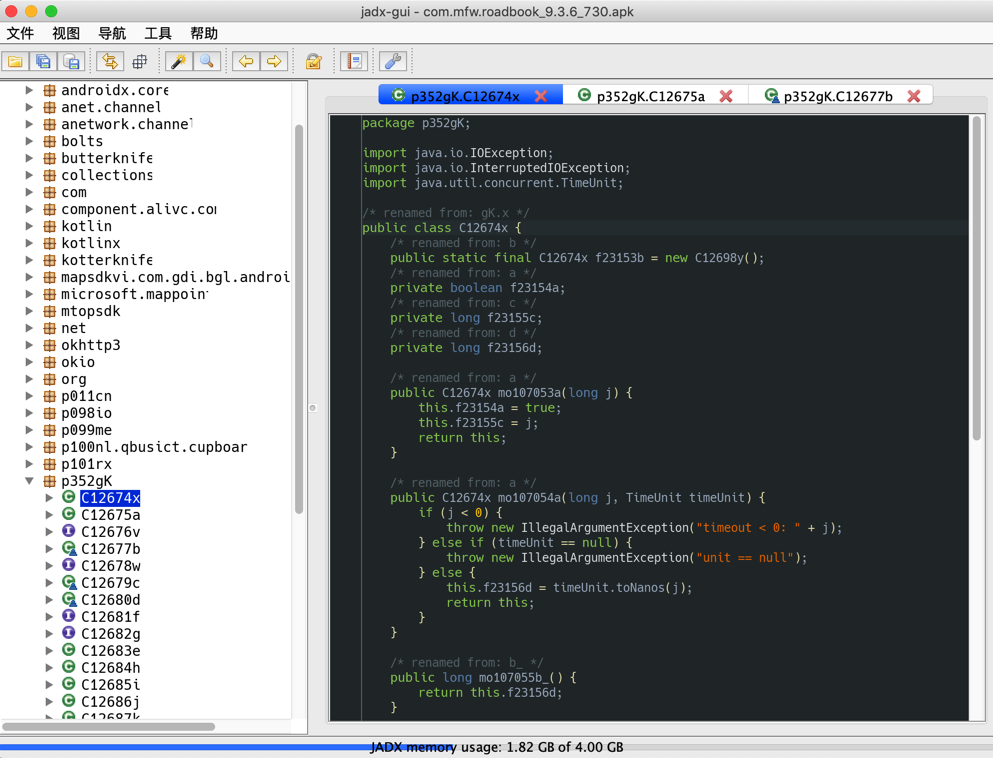

变量名改为了：`f23154a`，`f23155c`，虽然反混淆后的效果很一般，但是至少比a,b,c更容易看懂一些。
