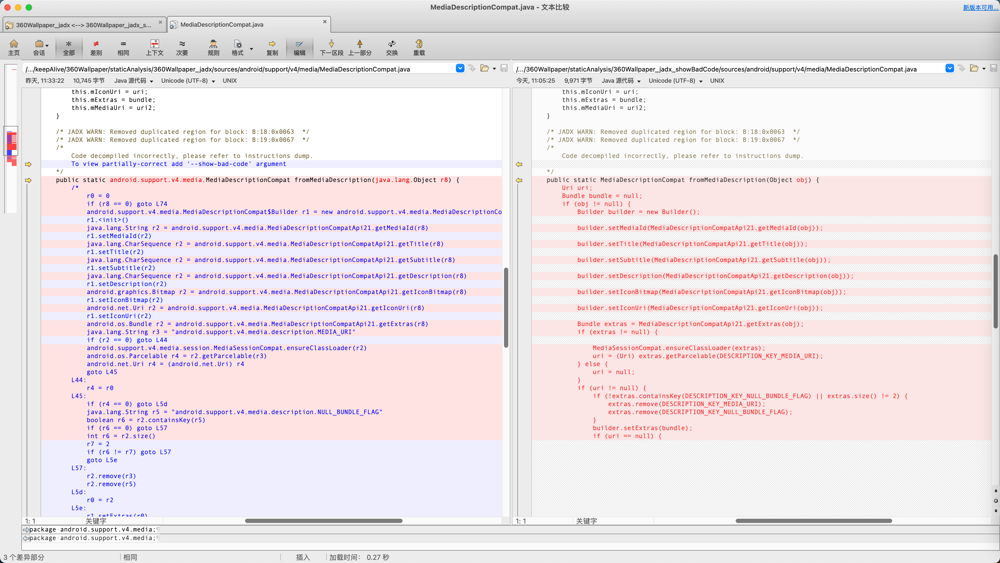

# 显示坏代码

用jadx反编译出的java代码中，有时候会看到类似的输出：

```java
    /*
        Code decompiled incorrectly, please refer to instructions dump.
        To view partially-correct add '--show-bad-code' argument
    */
```

举例：

* `360Wallpaper_jadx/sources/androidx/core/content/pm/ShortcutManagerCompat.java`

```java
    /* JADX WARN: Removed duplicated region for block: B:7:0x002b  */
    /*
        Code decompiled incorrectly, please refer to instructions dump.
        To view partially-correct add '--show-bad-code' argument
    */
    private static java.util.List<androidx.core.content.pm.ShortcutInfoChangeListener> getShortcutInfoListeners(android.content.Context r8) {
        /*
            java.util.List<androidx.core.content.pm.ShortcutInfoChangeListener> r0 = androidx.core.content.pm.ShortcutManagerCompat.sShortcutInfoChangeListeners
            if (r0 != 0) goto L71
            java.util.ArrayList r0 = new java.util.ArrayList
            r0.<init>()
            android.content.pm.PackageManager r1 = r8.getPackageManager()
            android.content.Intent r2 = new android.content.Intent
            java.lang.String r3 = "androidx.core.content.pm.SHORTCUT_LISTENER"
            r2.<init>(r3)
            java.lang.String r3 = r8.getPackageName()
            r2.setPackage(r3)
            r3 = 128(0x80, float:1.794E-43)
            java.util.List r1 = r1.queryIntentActivities(r2, r3)
            java.util.Iterator r1 = r1.iterator()
...
...
...
        L6b:
            java.util.List<androidx.core.content.pm.ShortcutInfoChangeListener> r8 = androidx.core.content.pm.ShortcutManagerCompat.sShortcutInfoChangeListeners
            if (r8 != 0) goto L71
            androidx.core.content.pm.ShortcutManagerCompat.sShortcutInfoChangeListeners = r0
        L71:
            java.util.List<androidx.core.content.pm.ShortcutInfoChangeListener> r8 = androidx.core.content.pm.ShortcutManagerCompat.sShortcutInfoChangeListeners
            return r8
        */
        throw new UnsupportedOperationException("Method not decompiled: androidx.core.content.pm.ShortcutManagerCompat.getShortcutInfoListeners(android.content.Context):java.util.List");
    }
```

其含义是：

当jadx反编译某个类=输出的单个java文件期间，部分内容，比如某个类的某个函数、某个函数中部分的代码等，无法完整的反编译=反编译期间遇到一些无法解析的错误，此时，就会显示出上述提示

而我们，其实对于部分解析出错的代码，并不是特别关心

反编译结果虽然有错误，但是对于伪代码用来查看大致的代码逻辑，则总体影响不大

所以希望：忽略这些解释的错误，尽可能多的显示出反编译的结果（有些个别的错误，可以忽略）

为了实现此目的，则可以去：

* 开启坏代码

## 如何开启坏代码功能

* 如何开启坏代码功能 = 开启坏代码的具体操作方式
  * cli=命令行：加上`--show-bad-code`
    * 举例
      ```bash
      jadx --show-bad-code -d . 360Wallpaper_1.0.4_apkcombo.com.apk
      ```
  * GUI=图形界面中：勾选：`Show inconsistent code`
    * 举例
      * 

## 开启坏点前后的效果对比

* 文件：`360Wallpaper_jadx/sources/android/support/v4/media/MediaDescriptionCompat.java`
  * 截图对比
    * 
  * 代码对比
    * 开启坏代码之前
```java
    /* JADX WARN: Removed duplicated region for block: B:18:0x0063  */
    /* JADX WARN: Removed duplicated region for block: B:19:0x0067  */
    /*
        Code decompiled incorrectly, please refer to instructions dump.
        To view partially-correct add '--show-bad-code' argument
    */
    public static android.support.v4.media.MediaDescriptionCompat fromMediaDescription(java.lang.Object r8) {
        /*
            r0 = 0
            if (r8 == 0) goto L74
            android.support.v4.media.MediaDescriptionCompat$Builder r1 = new android.support.v4.media.MediaDescriptionCompat$Builder
            r1.<init>()
            java.lang.String r2 = android.support.v4.media.MediaDescriptionCompatApi21.getMediaId(r8)
            r1.setMediaId(r2)
            java.lang.CharSequence r2 = android.support.v4.media.MediaDescriptionCompatApi21.getTitle(r8)
            r1.setTitle(r2)
            java.lang.CharSequence r2 = android.support.v4.media.MediaDescriptionCompatApi21.getSubtitle(r8)
            r1.setSubtitle(r2)
            java.lang.CharSequence r2 = android.support.v4.media.MediaDescriptionCompatApi21.getDescription(r8)
            r1.setDescription(r2)
            android.graphics.Bitmap r2 = android.support.v4.media.MediaDescriptionCompatApi21.getIconBitmap(r8)
            r1.setIconBitmap(r2)
            android.net.Uri r2 = android.support.v4.media.MediaDescriptionCompatApi21.getIconUri(r8)
            r1.setIconUri(r2)
            android.os.Bundle r2 = android.support.v4.media.MediaDescriptionCompatApi21.getExtras(r8)
            java.lang.String r3 = "android.support.v4.media.description.MEDIA_URI"
            if (r2 == 0) goto L44
            android.support.v4.media.session.MediaSessionCompat.ensureClassLoader(r2)
            android.os.Parcelable r4 = r2.getParcelable(r3)
            android.net.Uri r4 = (android.net.Uri) r4
            goto L45
        L44:
            r4 = r0
        L45:
            if (r4 == 0) goto L5d
            java.lang.String r5 = "android.support.v4.media.description.NULL_BUNDLE_FLAG"
            boolean r6 = r2.containsKey(r5)
            if (r6 == 0) goto L57
            int r6 = r2.size()
            r7 = 2
            if (r6 != r7) goto L57
            goto L5e
        L57:
            r2.remove(r3)
            r2.remove(r5)
        L5d:
            r0 = r2
        L5e:
            r1.setExtras(r0)
            if (r4 == 0) goto L67
            r1.setMediaUri(r4)
            goto L6e
        L67:
            android.net.Uri r0 = android.support.v4.media.MediaDescriptionCompatApi23.getMediaUri(r8)
            r1.setMediaUri(r0)
        L6e:
            android.support.v4.media.MediaDescriptionCompat r0 = r1.build()
            r0.mDescriptionObj = r8
        L74:
            return r0
        */
        throw new UnsupportedOperationException("Method not decompiled: android.support.v4.media.MediaDescriptionCompat.fromMediaDescription(java.lang.Object):android.support.v4.media.MediaDescriptionCompat");
    }
```
    * 开启坏代码之后
```java
    /* JADX WARN: Removed duplicated region for block: B:18:0x0063  */
    /* JADX WARN: Removed duplicated region for block: B:19:0x0067  */
    /*
        Code decompiled incorrectly, please refer to instructions dump.
    */
    public static MediaDescriptionCompat fromMediaDescription(Object obj) {
        Uri uri;
        Bundle bundle = null;
        if (obj != null) {
            Builder builder = new Builder();
            builder.setMediaId(MediaDescriptionCompatApi21.getMediaId(obj));
            builder.setTitle(MediaDescriptionCompatApi21.getTitle(obj));
            builder.setSubtitle(MediaDescriptionCompatApi21.getSubtitle(obj));
            builder.setDescription(MediaDescriptionCompatApi21.getDescription(obj));
            builder.setIconBitmap(MediaDescriptionCompatApi21.getIconBitmap(obj));
            builder.setIconUri(MediaDescriptionCompatApi21.getIconUri(obj));
            Bundle extras = MediaDescriptionCompatApi21.getExtras(obj);
            if (extras != null) {
                MediaSessionCompat.ensureClassLoader(extras);
                uri = (Uri) extras.getParcelable(DESCRIPTION_KEY_MEDIA_URI);
            } else {
                uri = null;
            }
            if (uri != null) {
                if (!extras.containsKey(DESCRIPTION_KEY_NULL_BUNDLE_FLAG) || extras.size() != 2) {
                    extras.remove(DESCRIPTION_KEY_MEDIA_URI);
                    extras.remove(DESCRIPTION_KEY_NULL_BUNDLE_FLAG);
                }
                builder.setExtras(bundle);
                if (uri == null) {
                    builder.setMediaUri(uri);
                } else {
                    builder.setMediaUri(MediaDescriptionCompatApi23.getMediaUri(obj));
                }
                MediaDescriptionCompat build = builder.build();
                build.mDescriptionObj = obj;
                return build;
            }
            bundle = extras;
            builder.setExtras(bundle);
            if (uri == null) {
            }
            MediaDescriptionCompat build2 = builder.build();
            build2.mDescriptionObj = obj;
            return build2;
        }
        return null;
    }
```
