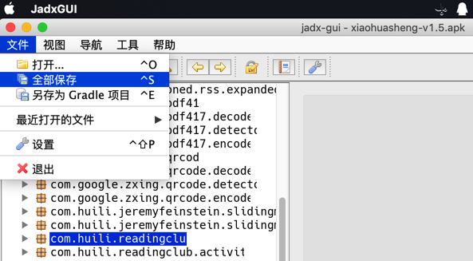
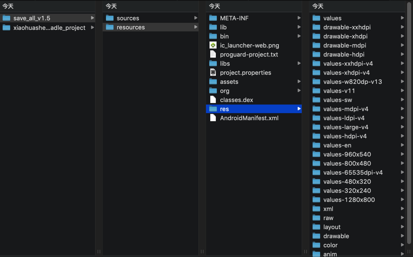
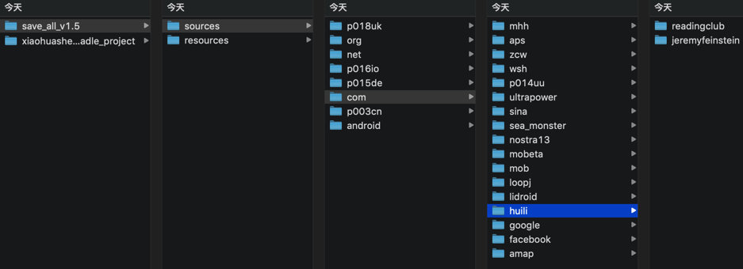

# jadx基本用法

## 命令行：`jadx`

* 命令行：`jadx`
  * 处理`apk`
    * 语法
      ```bash
      jadx -d output_folder your_apk_file.apk
      ```
    * 举例
      ```bash
      jadx/jadx-0.9.0/bin/jadx -d from_jadx_command xiaohuasheng-v1.5.apk
      jadx/jadx-0.9.0/bin/jadx -d exported_java_src mafengwo_ziyouxing.apk
      ```
  * 处理`dex`
    * 语法
        ```bash
        jadx -d output_folder your_dex_file.dex
        ```
    * 举例
      ```bash
      jadx-0.9.0/bin/jadx some_dex_file.dex -d .
      jadx-1.0.0/bin/jadx com.ishowedu.child.peiyin8392664.dex -d com.ishowedu.child.peiyin8392664_java
      ```

## GUI：`jadx-gui`

使用方式：双击`bin/jadx-gui`，即可打开界面

### 用`jadx-gui`导出全部代码

`文件 -> 全部保存`



即可下载到：

* 各种资源：`resources`
* 源码：`sources`
  * 其中的`sources`，和`文件 -> 另存为Gradle项目`所导出的代码是一样的



其中就有我们希望的app的业务逻辑的代码：


