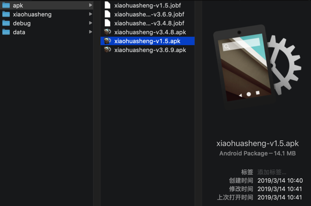
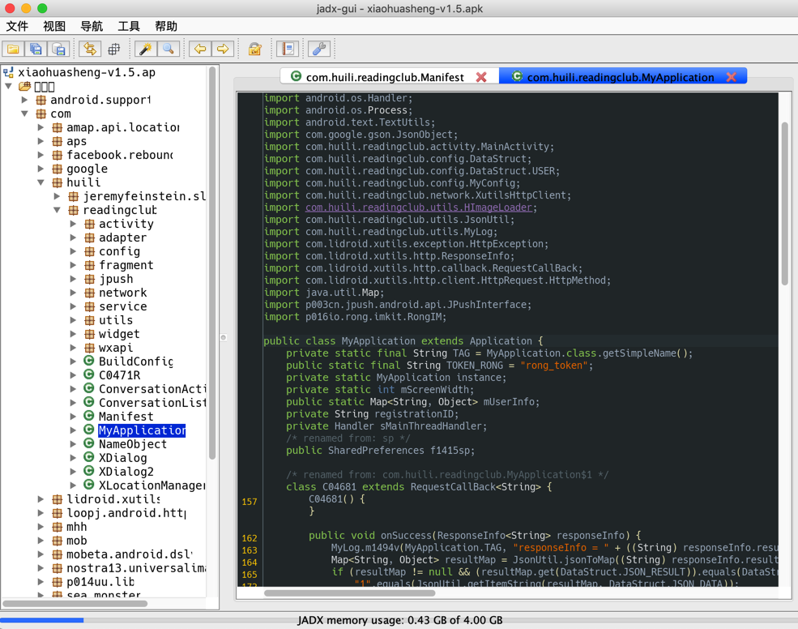
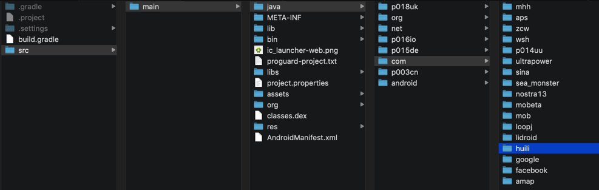

# jadx从apk导出java

此处用`jadx`工具，直接从`apk`转换出`java`源代码

## 准备

下载`jadx`：

从[skylot/jadx: Dex to Java decompiler](https://github.com/skylot/jadx)的[releases页面](https://github.com/skylot/jadx/releases)下载最新版本，比如[jadx-0.9.0.zip](https://github.com/skylot/jadx/releases/download/v0.9.0/jadx-0.9.0.zip)

解压得到：

* `bin/jadx`：命令行版本
  * `bin/jadx.bat`：Windows版
* `bin/jadx-gui`：带图形界面的版本
  * `bin/jadx-gui.bat`：Windows版

### jadx命令行版

直接通过命令行去反编译，效率最高。

语法：

```bash
jadx -d output_folder your_apk_file.apk
```

举例：

```bash
jadx/jadx-0.9.0/bin/jadx -d from_jadx_command xiaohuasheng-v1.5.apk
jadx/jadx-0.9.0/bin/jadx -d exported_java_src mafengwo_ziyouxing.apk
jadx -d . LiftFileManager-FileClean_1.3.1_Apkpure.apk
jadx -d . 360Wallpaper_1.0.4_apkcombo.com.apk
```

输出举例：

```bash
➜  input jadx -d . 360Wallpaper_1.0.4_apkcombo.com.apk
INFO  - loading ...
INFO  - processing ...
ERROR - finished with errors, count: 74
```

### jadx gui图形界面版

下面以`jadx-gui`(已被我改名为`JadxGUI`)为例去解释。

对于此处v1.5这种没有加固的apk：



`jadx`（此处指的是`jadx-gui`）打开后：


可以看到源码：



想要导出全部源码，则可以去

`文件 -> 全部保存`

或

`文件 -> 另存为Gradle项目`


即可导出全部的代码：



用VSCode打开后即可找到（希望研究的app对应的业务逻辑的）代码：


