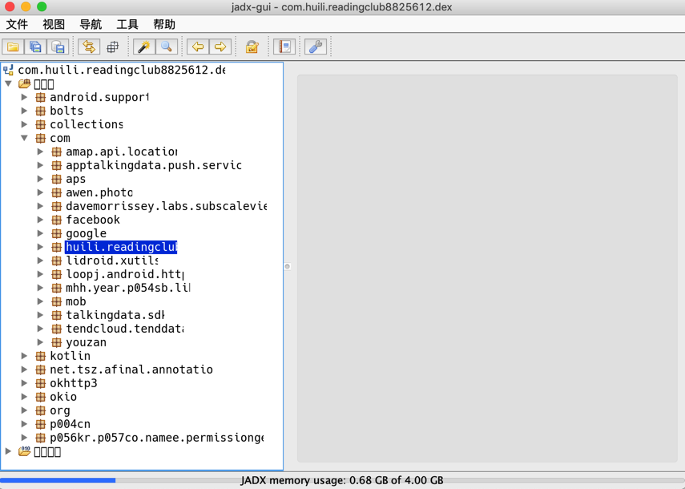
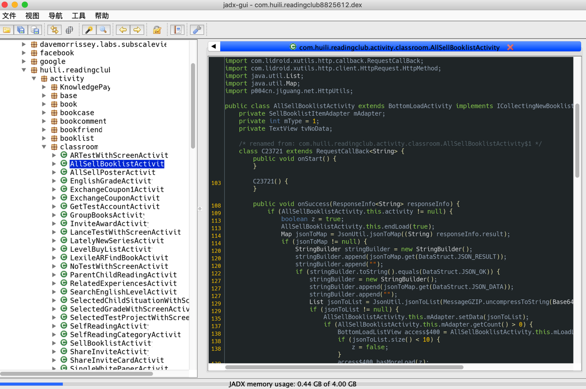

# jadx从dex导出java

`jadx`可以直接从`dex`导出`java`源码：

切换到要导出代码的目录，已有dex文件要导出，则可以直接运行：

* 语法=命令
  ```bash
  jadx dex_file.dex -d output_folder
  ```
 * 举例
    ```bash
    jadx-0.9.0/bin/jadx dex_file.dex -d .

    jadx/jadx-1.0.0/bin/jadx com.ishowedu.child.peiyin8392664.dex -d com.ishowedu.child.peiyin8392664_java
    ```
* 输出
  * 即可转换出源代码到当前目录下，输出有：
    * `resources`
    * `sources`
      * 有你要的源码
  * 转换速度还是不错的

## 举例

```bash
from_v3.4.8_dex /Users/crifan/dev/dev_tool/android/reverse_engineering/jadx/jadx-0.9.0/bin/jadx ../../../../../xiaohuasheng/app_hook_dump_dex/FDex2/v3.4.8/com.huili.readingclub8825612.dex -d .
...
中间很多错误
...
WARN  - Found 75 references to unknown classes
ERROR - 6 errors occurred in following nodes:
ERROR -   Method: android.support.v4.provider.FontsContractCompat.getFontFromProvider(android.content.Context, android.support.v4.provider.FontRequest, java.lang.String, android.os.CancellationSignal):android.support.v4.provider.FontsContractCompat$FontInfo[]
ERROR -   Method: cn.addapp.pickers.util.LogUtils.getTraceElement():java.lang.String
ERROR -   Method: cn.jiguang.a.a.b.c.a(android.os.Message):void
ERROR -   Method: cn.jiguang.d.b.f.a(int):boolean
ERROR -   Method: cn.jiguang.d.d.m.a(android.content.Context, boolean):java.util.List<java.io.File>
ERROR -   Method: cn.jiguang.g.e.a(java.lang.String, java.util.Map):cn.jiguang.g.e
WARN  - 2299 warnings in 454 nodes
ERROR - finished with errors
```

转换后：

```bash
➜  from_v3.4.8_dex ll
total 0
drwxr-xr-x   3 crifan  staff    96B  4 29 15:29 resources
drwxr-xr-x  13 crifan  staff   416B  4 29 15:30 sources
```

转换后的代码用VSCode去打开的效果：


### `jadx-gui`查看和导出代码

双击`jadx-gui`即可运行：


然后去打开对应的jar文件：`com.huili.readingclub8825612-dex2jar.jar`，即可看到包含了app业务逻辑的代码结构和包名：



然后展开后可以看到详细的代码：



然后如果想要导出全部代码，则可以去：

`File -> Save All`


然后稍等片刻：


即可在导出的`sources`文件夹中找到你要的源码：


