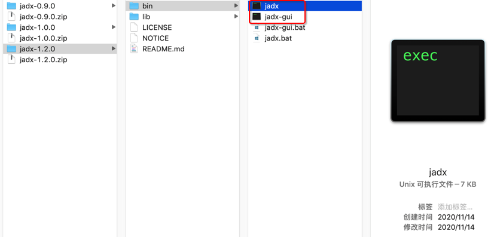

# jadx下载

* 从[jadx的release页面](https://github.com/skylot/jadx/releases)，可下载到最新版的`jadx`
  * 比如：
    * [jadx-1.2.0.zip](https://github.com/skylot/jadx/releases/download/v1.2.0/jadx-1.2.0.zip)
  * 得到`jadx-1.2.0.zip`，解压后的`bin`目录中有：
    * 图
      * 
    * 文字说明
      * 命令行版本=也称为：`jadx-cli`
        * `Mac`/`Linux`的`jadx`
        * `Win`的`jadx.bat`
      * 带图形界面的GUI版本
        * 文件
          * `Mac`/`Linux`的`jadx-gui`
          * `Win`的`jadx-gui.bat`
        * 说明
          * 双击即可运行
          * 可以用来查看反编译后的代码，也支持导出反编译后的代码

所以想要使用jadx反编译出代码，可以用

* 命令行：`jadx`
  * 直接导出代码
* 图形界面：`jadx-gui` 
  * 查看反编译的结果，再导出代码
