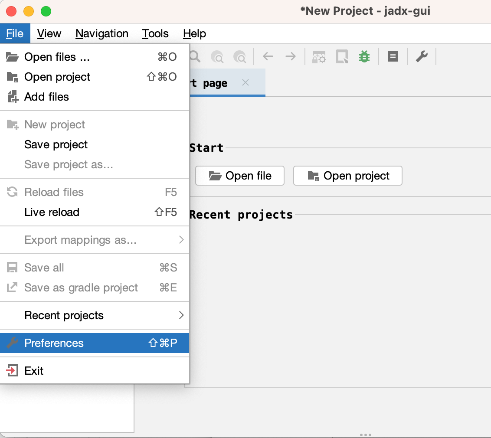
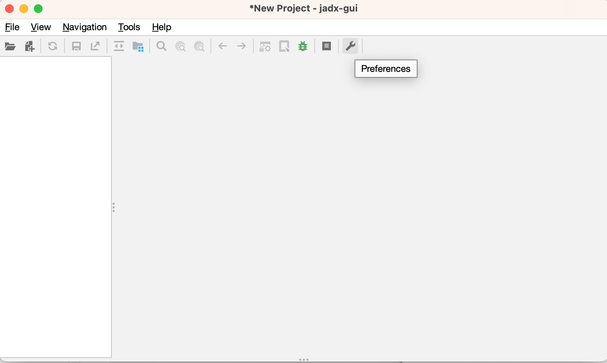
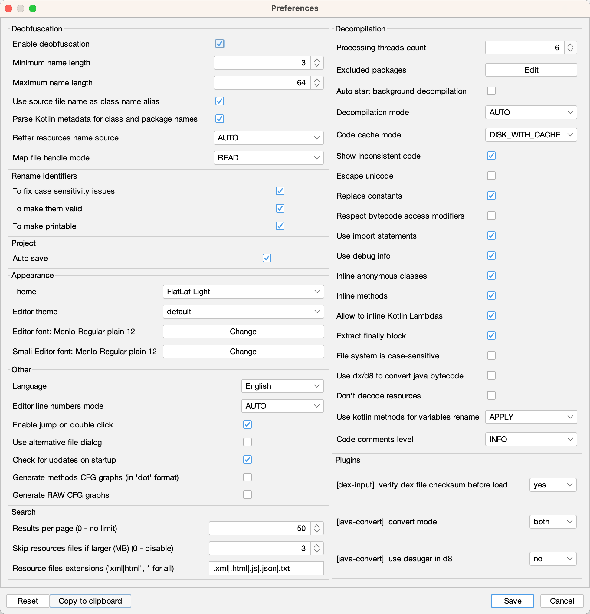

# GUI版本中的参数设置页面

* 打开参数设置页面的2种方式
  * `File`->`Preferences`
    * 
  * 点击工具栏中的`Preferences`图标
    * 

参数设置界面：



以及点击`Copy to clipboard`后得到的（JSON格式的）配置信息：

```json
{
  "flattenPackage": false,
  "checkForUpdates": true,
  "fontStr": "",
  "smaliFontStr": "",
  "editorThemePath": "/org/fife/ui/rsyntaxtextarea/themes/default.xml",
  "lafTheme": "FlatLaf Light",
  "langLocale": {
    "locale": "en_US"
  },
  "autoStartJobs": false,
  "excludedPackages": "",
  "autoSaveProject": true,
  "showHeapUsageBar": false,
  "alwaysSelectOpened": false,
  "useAlternativeFileDialog": false,
  "codeAreaLineWrap": false,
  "srhResourceSkipSize": 3,
  "srhResourceFileExt": ".xml|.html|.js|.json|.txt",
  "searchResultsPerPage": 50,
  "useAutoSearch": true,
  "keepCommonDialogOpen": false,
  "smaliAreaShowBytecode": false,
  "lineNumbersMode": "AUTO",
  "mainWindowVerticalSplitterLoc": 300,
  "debuggerStackFrameSplitterLoc": 300,
  "debuggerVarTreeSplitterLoc": 700,
  "adbDialogPath": "",
  "adbDialogHost": "localhost",
  "adbDialogPort": "5037",
  "codeCacheMode": "DISK_WITH_CACHE",
  "jumpOnDoubleClick": true,
  "treeWidth": 130,
  "settingsVersion": 18,
  "skipResources": false,
  "skipSources": false,
  "exportAsGradleProject": false,
  "threadsCount": 6,
  "decompilationMode": "AUTO",
  "showInconsistentCode": true,
  "useImports": true,
  "debugInfo": true,
  "addDebugLines": false,
  "inlineAnonymousClasses": true,
  "inlineMethods": true,
  "allowInlineKotlinLambda": true,
  "extractFinally": true,
  "replaceConsts": true,
  "escapeUnicode": false,
  "respectBytecodeAccessModifiers": false,
  "deobfuscationOn": true,
  "deobfuscationMinLength": 3,
  "deobfuscationMaxLength": 64,
  "deobfuscationMapFileMode": "READ",
  "deobfuscationUseSourceNameAsAlias": true,
  "deobfuscationParseKotlinMetadata": true,
  "resourceNameSource": "AUTO",
  "useKotlinMethodsForVarNames": "APPLY",
  "renameFlags": [
    "CASE",
    "VALID",
    "PRINTABLE"
  ],
  "fsCaseSensitive": false,
  "cfgOutput": false,
  "rawCfgOutput": false,
  "fallbackMode": false,
  "useDx": false,
  "commentsLevel": "INFO",
  "pluginOptions": {}
}
```

