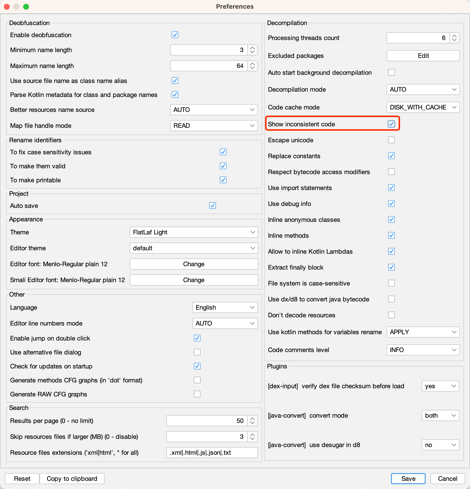

# cli和gui参数对应关系

jadx分cli=命令行和gui=图形界面，共2个版本。

而其中很多功能，本质上是一样的

举例：

* 开启坏代码
  * jadx-cli中加参数`--show-bad-code`
    * 举例
      ```bash
      jadx --deobf --show-bad-code -d . 360Wallpaper_1.0.4_apkcombo.com.apk
      ```
  * jadx-gui中参数设置页中勾选：`Show inconsistent code`
    *  

因此就有了：同样的功能，不同版本中的开启（关闭）的方式，即：

* cli=命令行 和 gui=图形界面 的不同功能的映射关系

| 功能点 | jadx-gui | jadx-cli |
| ----- | -------- | -------- |
| 显示坏代码 | 勾选 Show inconsistent code | --show-bad-code |
| 开启反混淆 | 勾选 Enable deobfuscation | --deobf |
|   |   | --deobf-min |
|   |   | --deobf-max |
|   |   | --deobf-cfg-file |
|   |   | --deobf-cfg-file-mode read/read-or-save/overwrite/ignore |
|   |   | --deobf-use-sourcename |
|   |   | --deobf-parse-kotlin-metadata |
|   |   | --deobf-res-name-source |
|   | 取消勾选 all Rename identifiers flags | --rename-flags none |
| 关闭内联 | 取消勾选 Inline anonymous classes | --no-inline-anonymous |
|   | 取消勾选 Inline methods | --no-inline-methods |
|   | 勾选 Generate methods CFG graphs | --cfg |
|   | 勾选 Generate RAW CFG grapths | --raw-cfg |
|   | 取消勾选  Move inner classes into parent | --no-move-inner-classes |
