# 相关页面

## 菜单栏

* View
  * 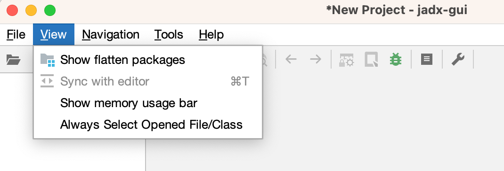
* Navigation
  * 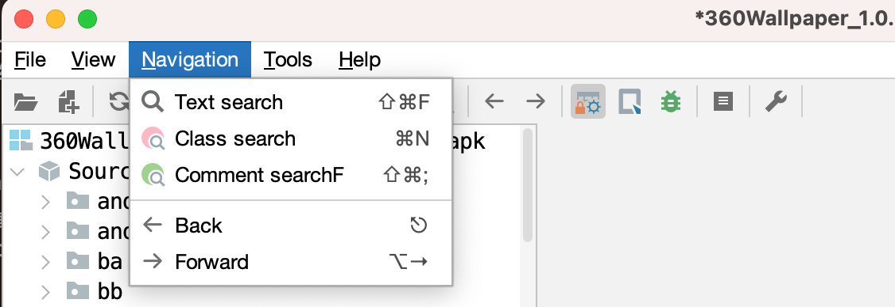
* Tools
  * 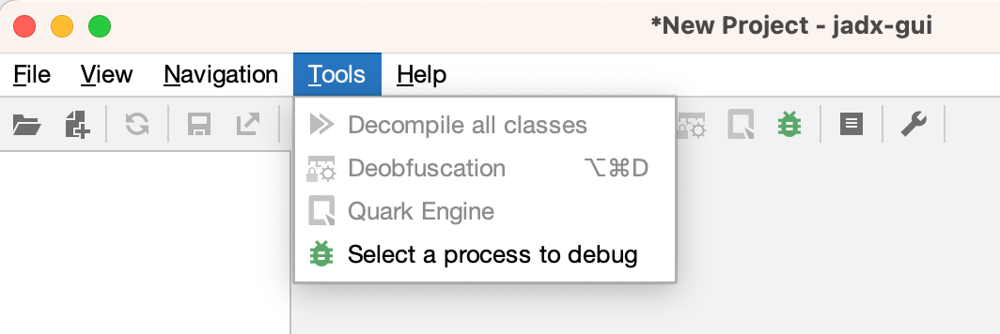
* Help
  * 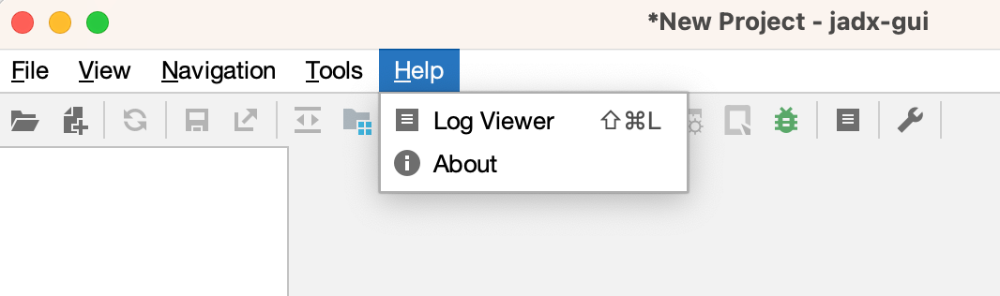

## View视图

### 显示内存使用

勾选：`View`->`Show memory usage bar`

可以在底部显示JADX的内存使用量：

* 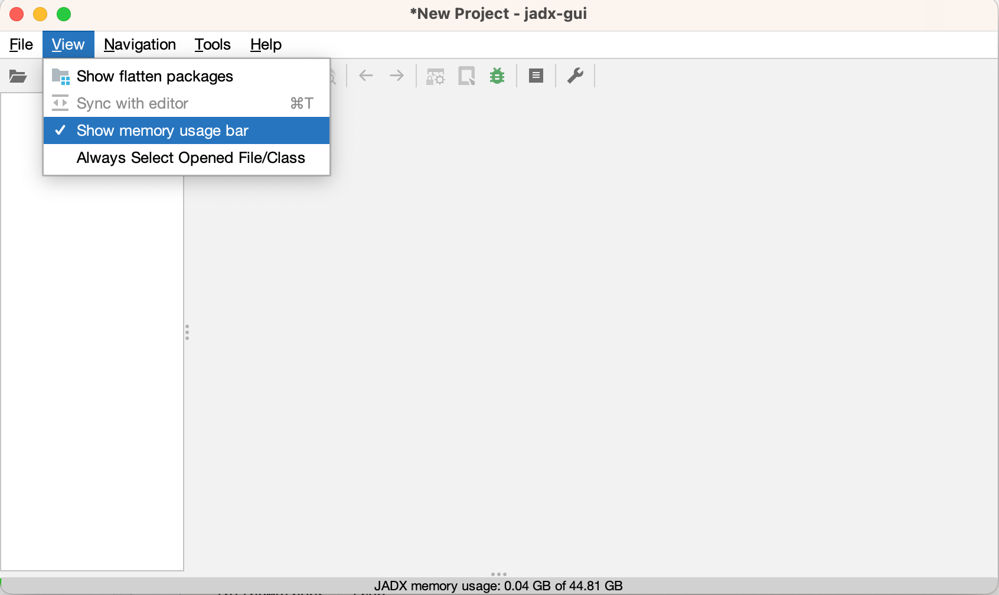

-》估计是防止，反编译太大的apk，导致内存占用太多，而导致崩溃时，至少知道是内存方面的问题。

### 调试进程

`Tool`->`Select a process to debug`

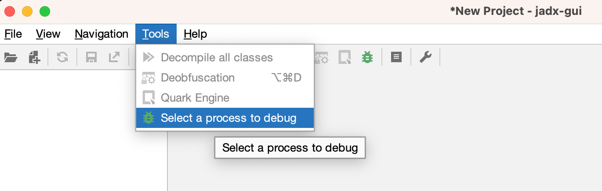

或点击：

工具栏中bug虫子的图标：

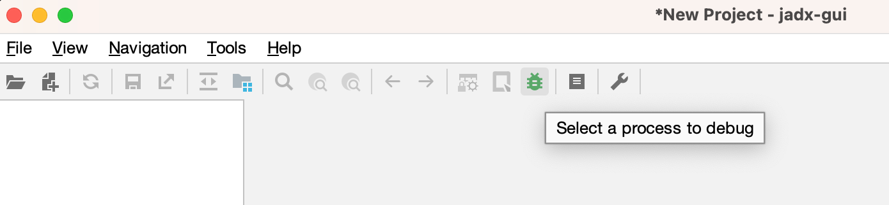

可以打开：

ADB调试窗口：

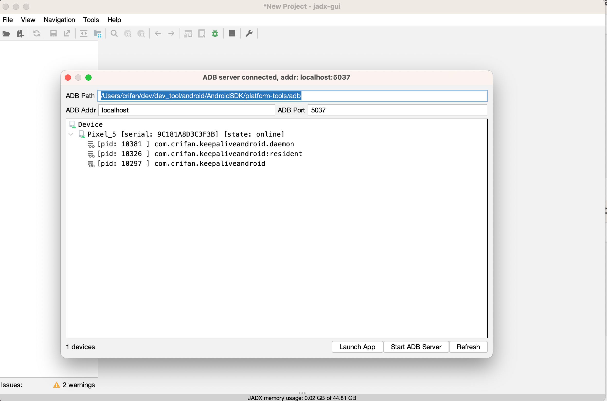

此处自动找到了：

* ADB的path
* ADB的Address 和port

以及：

目标安卓设备中，（debuggable）可以调试的进程 = 此处是自己之前AS调试安装过的一个app：KeepAliveAndroid的相关进程

### 日志查看器

* 打开`Log Viewer`=`日志查看器`的方式
  * `Help`->`Log Viewer`
    * 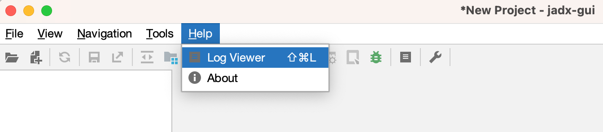
  * 工具栏中点击：日志图标
    * 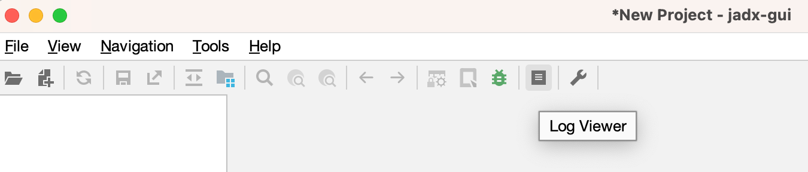

可以打开：日志查看器

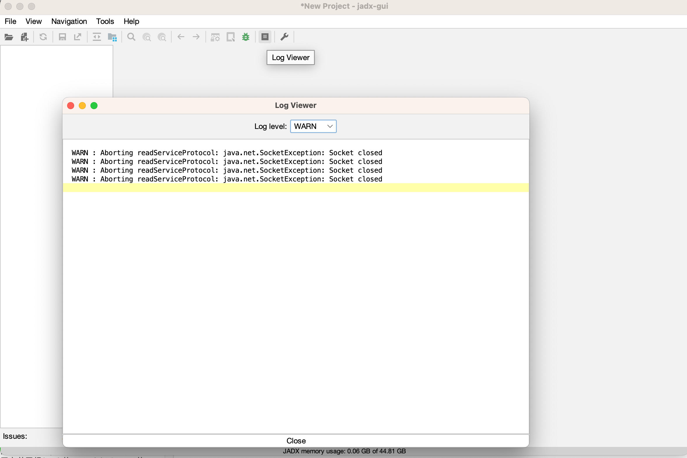
