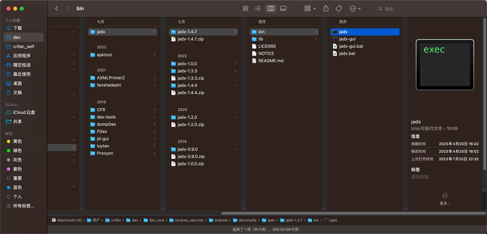
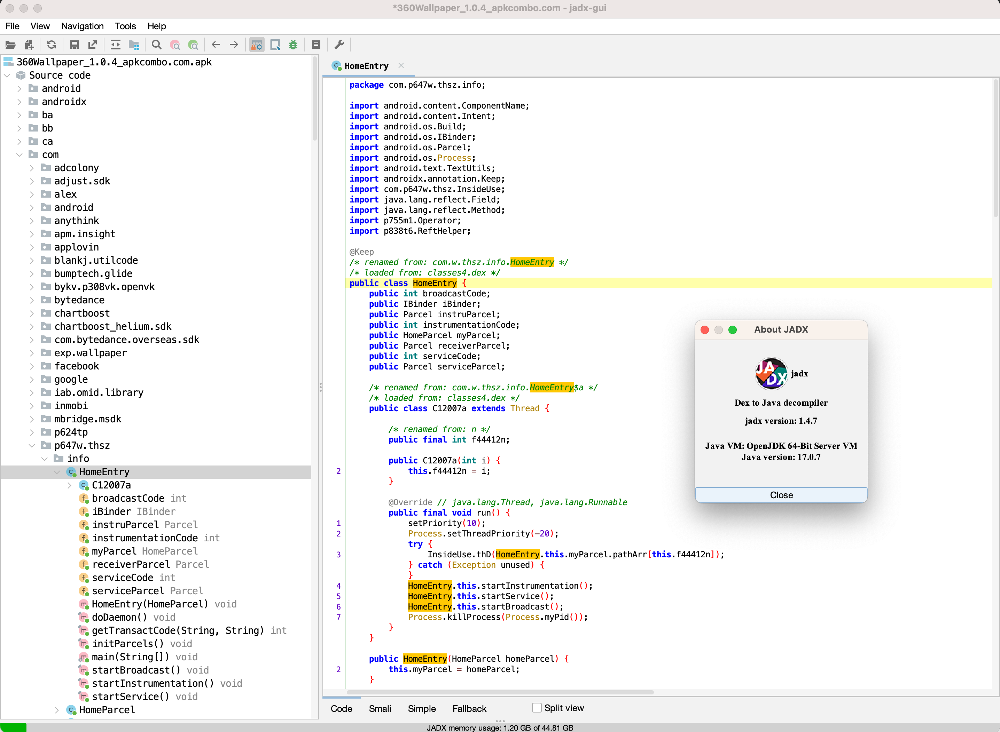
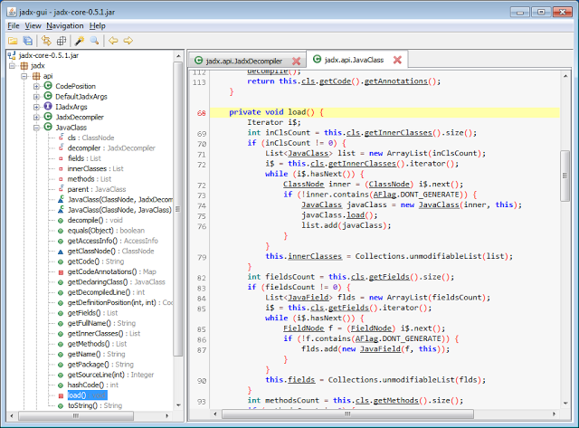

# jadx概览

[安卓逆向](https://book.crifan.org/books/android_reverse_dev/website/)期间用到的，静态分析时涉及到的，从`apk`/`dex`转`java`的反编译器，有多种：

* `jadx`
* `JEB`
* `GDA`

等，其中，比较好用（之一的）是：`jadx`

## jadx

* `jadx`
  * 主页
    * [skylot/jadx: Dex to Java decompiler](https://github.com/skylot/jadx)
  * 功能
    * 从`dex`或`apk`文件中转换出`java`源代码的反编译器
  * 两种模式/版本
    * `命令行`版本=`command line version`=`jadx-cli`：`jadx`
      * 
    * `图形界面`版本=`GUI`=`graphical version`：`jadx-gui`=`JadxGUI`
      * 注：也有很多人常把GUI版本`jadx-gui`简称为`jadx`，注意不要搞混淆了
      * jadx的gui版
        * 新版
          * 
        * 旧版
          * 
