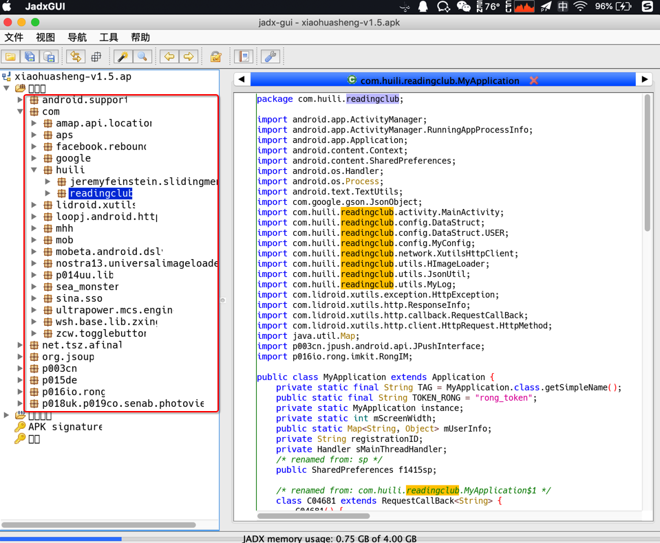

# jadx使用心得

## 经验心得

### 从`jadx-gui`打开的结构看出是否加固和是哪家的加固

对于某个安卓的apk，用`jadx-gui`打开不同版本的apk的效果是：

* v1.5
  * 
* v3.4.8
  * 
* v3.6.9
  * 

-》可以看出apk是否被加固以及用了何种加固方案：

* `v1.5`：没有被加固
* `v3.4.8`：加固方案 qihoo奇虎360
* `v3.6.9`：加固方案 腾讯乐固legu

## 常见错误

### `jadx`不能从`jar`导出`java`，否则会报错

举例：

```bash
../../../../../reverse_engineering/jadx/jadx-1.0.0/bin/jadx ../dex_to_jar/com.ishowedu.child.peiyin9201516-dex2jar.jar -d .
INFO  - loading ...
INFO  - converting to dex: com.ishowedu.child.peiyin9201516-dex2jar.jar ...
ERROR - jadx error: Error load file: ../dex_to_jar/com.ishowedu.child.peiyin9201516-dex2jar.jar
jadx.core.utils.exceptions.JadxRuntimeException: Error load file: ../dex_to_jar/com.ishowedu.child.peiyin9201516-dex2jar.jar
    at jadx.api.JadxDecompiler.loadFiles(JadxDecompiler.java:138)
    at jadx.api.JadxDecompiler.load(JadxDecompiler.java:102)
    at jadx.cli.JadxCLI.processAndSave(JadxCLI.java:32)
    at jadx.cli.JadxCLI.main(JadxCLI.java:18)
Caused by: jadx.core.utils.exceptions.DecodeException: java class to dex conversion error:
 dx exception: Translation has been interrupted
    at jadx.core.utils.files.InputFile.loadFromJar(InputFile.java:191)
    at jadx.core.utils.files.InputFile.searchDexFiles(InputFile.java:82)
    at jadx.core.utils.files.InputFile.addFilesFrom(InputFile.java:40)
    at jadx.api.JadxDecompiler.loadFiles(JadxDecompiler.java:136)
    ... 3 common frames omitted
Caused by: jadx.core.utils.exceptions.JadxException: dx exception: Translation has been interrupted
    at jadx.core.utils.files.JavaToDex.convert(JavaToDex.java:63)
    at jadx.core.utils.files.InputFile.loadFromJar(InputFile.java:182)
    ... 6 common frames omitted
Caused by: java.lang.RuntimeException: Translation has been interrupted
    at com.android.dx.command.dexer.Main.processAllFiles(Main.java:614)
    at com.android.dx.command.dexer.Main.runMultiDex(Main.java:365)
    at com.android.dx.command.dexer.Main.runDx(Main.java:286)
    at jadx.core.utils.files.JavaToDex.convert(JavaToDex.java:49)
    ... 7 common frames omitted
Caused by: java.lang.InterruptedException: Too many errors
    at com.android.dx.command.dexer.Main.processAllFiles(Main.java:606)
    ... 10 common frames omitted
```

### jadx转换出错：java.lang.OutOfMemoryError

如果用`jadx`转换代码期间出错：

```bash
java.lang.OutOfMemoryError: GC overhead limit exceeded
    at jadx.core.dex.visitors.blocksmaker.BlockProcessor.computeDominators(BlockProcessor.java:189)
    at jadx.core.dex.visitors.blocksmaker.BlockProcessor.processBlocksTree(BlockProcessor.java:52)
    at jadx.core.dex.visitors.blocksmaker.BlockProcessor.visit(BlockProcessor.java:42)
    at jadx.core.dex.visitors.DepthTraversal.visit(DepthTraversal.java:27)
    at jadx.core.dex.visitors.DepthTraversal.lambda$visit$1(DepthTraversal.java:14)
    at jadx.core.dex.visitors.DepthTraversal$$Lambda$19/469590976.accept(Unknown Source)
    at java.util.ArrayList.forEach(ArrayList.java:1249)
    at jadx.core.dex.visitors.DepthTraversal.visit(DepthTraversal.java:14)
    at jadx.core.ProcessClass.process(ProcessClass.java:32)
    at jadx.api.JadxDecompiler.processClass(JadxDecompiler.java:292)
    at jadx.api.JavaClass.decompile(JavaClass.java:62)
    at jadx.api.JadxDecompiler.lambda$appendSourcesSave$0(JadxDecompiler.java:200)
    at jadx.api.JadxDecompiler$$Lambda$13/1425454633.run(Unknown Source)
    at java.util.concurrent.ThreadPoolExecutor.runWorker(ThreadPoolExecutor.java:1142)
    at java.util.concurrent.ThreadPoolExecutor$Worker.run(ThreadPoolExecutor.java:617)
    at java.lang.Thread.run(Thread.java:745)
...
```

且同时伴有：

* CPU占用率很高
* 内存消耗也很大
  * 比如此处JadxCLI占用了4G的内存
    * 

就是典型的：`OOM`=`Out Of Memory`的问题了。

解决办法，有两种：

* 增加JVM最大内存
  * 逻辑：修改`jadx`脚本，增大`-Xmx`的值
  * 步骤：
    * 编辑`jadx-0.9.0/bin/jadx`，找到`DEFAULT_JVM_OPTS`的配置，修改其中`-Xmx`的值
    * 比如把此处的
      ```bash
      DEFAULT_JVM_OPTS='"-Xms128M" "-Xmx4g"'
      ```
    * 改为：
      ```bash
      DEFAULT_JVM_OPTS='"-Xms128M" "-Xmx6g"'
      ```
    * 即表示，把JVM最大内存，从之前的`4G`，增大到`6G`
    * 这样就运行`jadx`使用更多的内存，从而降低或消除`OOM`的问题了
* 减少线程数
  * 逻辑：通过`-j N`，N=1/2之类，减少进程数，从而降低内存占用，减少OOM的概率
  * 步骤：
    * 在命令行运行jadx时，传递`-j`参数，指定线程数，比如
      ```bash
      jadx -d output_folder -j 1 your_apk.apk
      ```
  * 缺点
    * 处理速度会有所降低
      * 因为默认`4`线程处理，反编译等速度会比较快
      * 线程数减少后，反编译等速度可能会有所影响

说明：

* 一般反编译小的不复杂的`apk`或`dex`，不会遇到`OOM`问题
* 反编译比较大型的，比较复杂的`apk`或`dex`，才可能会遇到`OOM`
  * 比如之前用jadx反编译马蜂窝时遇到了`OOM`
